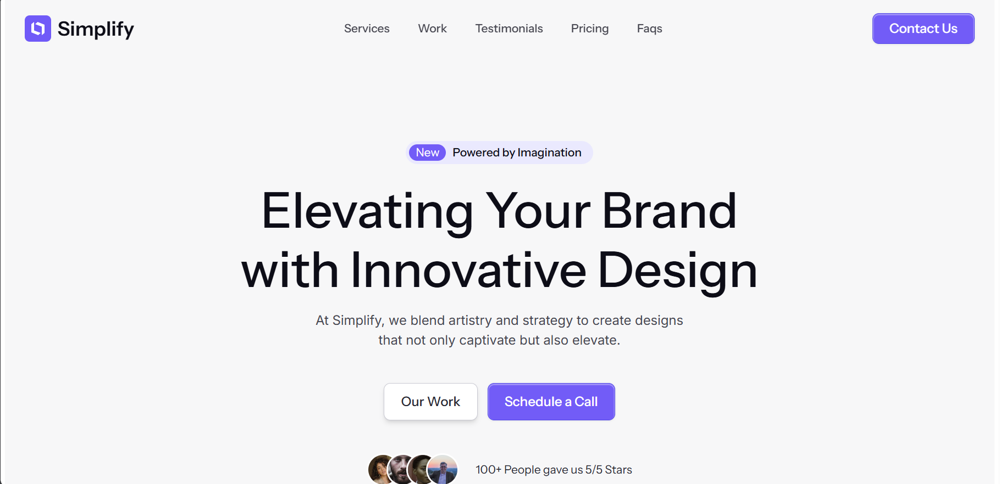
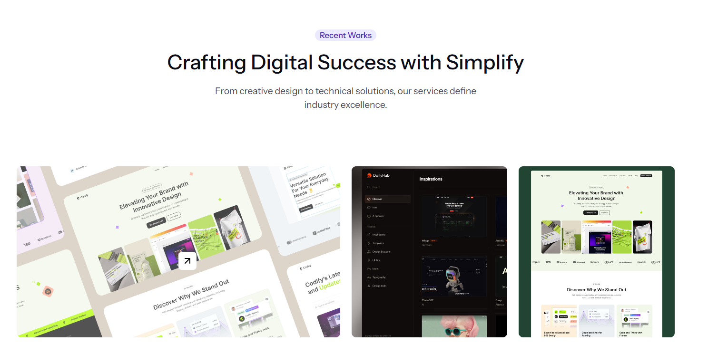
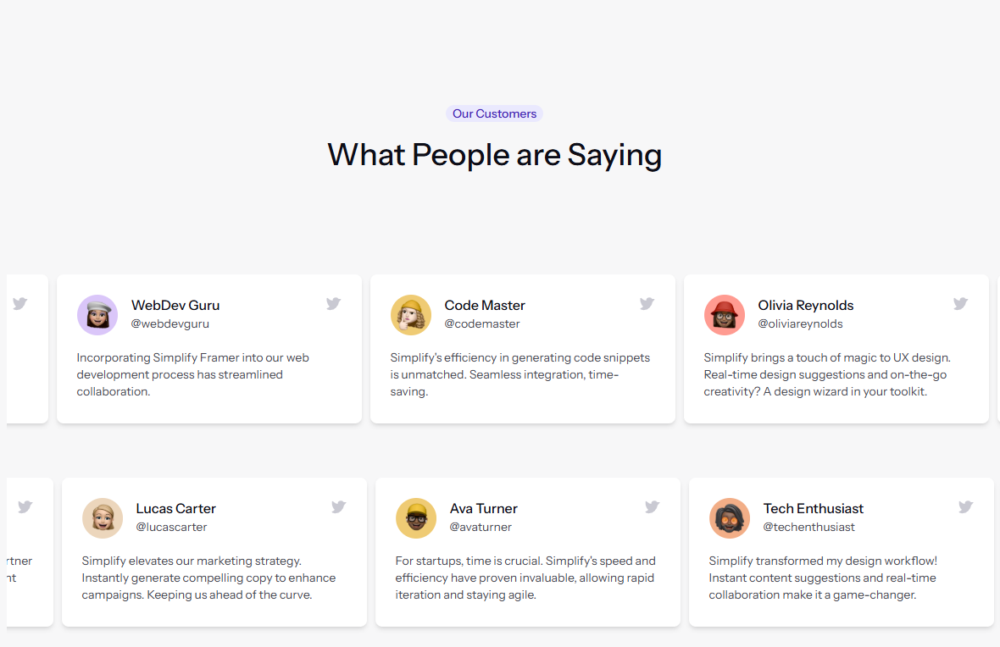

# Simplify - Website for a Design Agency

A landing page for a fictional design agency.

a recreation of the [Landify](https://landify.framer.website/) landing page design by [stylokit](https://stylokit.com/).

**Note:** the sole purpose of this project is to practice my front-end skills and to showcase my ability to recreate a design from scratch.
Although i am a fullstack developer, i am more inclined to front-end development and design.

This project was bootstrapped using the [create-react-vite-app](https://github.com/Nathan-Somto/create-react-vite-app) CLI tool by [Nathan-Somto](https://github.com/Nathan-Somto).

## Packages Installed

- framer-motion
- tailwindcss
- autoprefixer
- postcss

## Folder Structure

```
simplify
├── public
├── src
│   ├── assets
│   ├── components
│   ├── sections
│   ├── constants
│   ├── scripts
│   ├── styles
│   ├── App.tsx
│   ├── index.tsx
```

1. `public` - contains the static files for the project.
2. `src` - contains the source code for the project.
3. `assets` - contains the images and other assets used in the project.
4. `components` - contains the small blocks ui that is used to compose the sections. example `Button`, `Card`, `Footer`, `Header`, `Hero`, `Section`, `Testimonial`.
   **Note:** kebab case is used for the name of the components e.g `nav-bar` .
5. `sections` - contains the sections of the landing page. example `About`, `Contact`, `Features`, `Hero`, `Pricing`, `Testimonials`.
   **Note:** pascal case is used for the name of the sections e.g `RecentWorks` .
6. `styles` - contains all my stylesheets to keep them organized.
7. `constants` - houses static data, this is kept away from the jsx as a preference to keep it clean
8. `scripts` - some scripts written to scrape text from the design
9. `hooks` - custom hooks used in the site.

## Screenshots





[View live demo](https://example.com)

Please Leave a :star: if you liked it :smile:.
